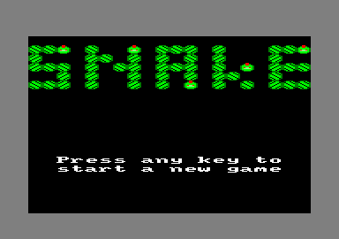
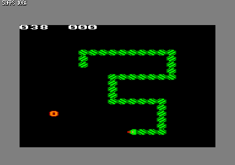
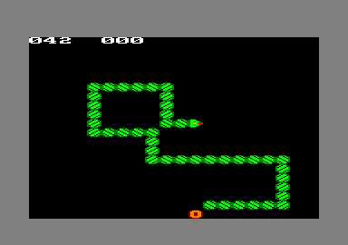

CPCSnake
========

CPCSnake es un clon del juego Snake Race para Amstrad CPC.

Se puede descargar el ``dsk`` desde la pestaña `releases
<https://github.com/patxoca/cpcsnake/releases/>`_.

La teclas de movimiento són ``J`` (izquierda), ``K`` (abajo), ``L``
(derecha) e ``I`` (arriba).

Está implementado en C utilizando la excelente biblioteca `CPCTelera
<https://github.com/lronaldo/cpctelera/>`_.
